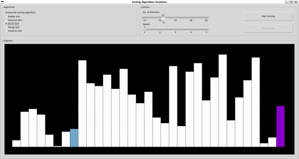

# Sorting Algorithms Visualizer
A GUI application developed in Python using Tkinter to visualize various sorting algorithms.

## Demo
<p align="center">
  
</p>

## How to Clone and Run the Project
To clone and run this project locally, follow these steps:

1. Make sure you have Python installed on your system. If not, you can download and install it from the official Python website.

2. Ensure that Tkinter is installed on your system. Tkinter usually comes pre-installed with Python. To verify if tkinter is installed and operational, execute the following command in your terminal:
    ```bash
    python -m tkinter

    # If not, you can install it using the following command:
    sudo apt-get install tk-dev
    ```

3. Clone this repository to your local machine. You can do this by opening a terminal or command prompt and running the following command:
    ```bash
    git clone https://github.com/suffer-sami/sorting-algorithms-visualizer.git
    ```

4. Navigate to the project directory:
    ```bash
    cd sorting-algorithms-visualizer
    ```
5. Run the main.py file:
    ```bash
    python main.py
    ```
6. The application window should open, allowing you to visualize various sorting algorithms by selecting them from the menu and clicking the "Start Sorting" button.

7. You can adjust the speed of visualization using the slider provided.

8. Enjoy visualizing different sorting algorithms!

## Contributing
Contributions are welcome! If you find any issues or have suggestions for improvements, feel free to open an issue or submit a pull request.